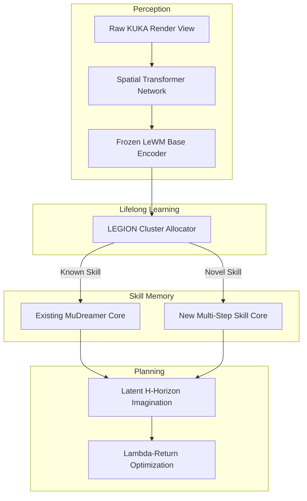

# JEPA-Dreamer: Reconstruction-Free Lifelong World Models in LEGION

An advanced, reconstruction-free Model-Based Reinforcement Learning (MBRL) pipeline optimized for robotic lifelong learning. This project integrates the stability of **LeWorldModel (LeWM)** and the latent policy imagination engine of **MuDreamer** into the **LEGION** multi-task framework, specifically targeted at the `Metaworld-KUKA-IIWA-R800` simulation suite.

## 🚀 Architectural Overview

Traditional world models (like DreamerV3) waste high-dimensional neural capacity trying to reconstruct complex visual backgrounds. JEPA-Dreamer completely removes pixel-reconstruction loss loops. 

Use code with caution.


### Key Advantages
* **Immunity to Visual Drifts:** The frozen LeWorldModel base utilizes a `SIGReg` regularizer to bound features into an isotropic Gaussian distribution, completely neutralizing visual noise.
* **Camera Perspective Invariance:** A front-end Spatial Transformer Network (STN) actively registers shifting camera angles back into canonical view alignments before feature encoding.
* **Extremely Low Memory Footprint:** Dropping image decoder networks cuts VRAM overhead significantly, allowing rapid multi-task expansions on consumer-grade hardware.

---

## 📁 Repository Directory Reference

* **`config/legion_jepa_dreamer.yaml`**  
  Centralized system config containing LEGION threshold multipliers, target action shapes, and imagination lookahead steps.
* **`src/perception.py`**  
  Houses the `CameraViewAligner` (STN spatial correction) and the canonical `LeWMEncoder` representation layers.
* **`src/imagination.py`**  
  Contains the `MuDreamerPredictor` world model, `MuDreamerActorCritic` continuous policies, and the temporal difference `MuDreamerValueTrainer`.
* **`src/lifelong.py`**  
  Manages multi-task routing via a latent-space cosine similarity allocator and dynamic tracking reward standardization.
* **`src/telemetry.py`**  
  Monitors performance tracking across hidden spaces through a dedicated TensorBoard pipeline.

---

## 🛠️ Installation & Requirements

Ensure you are using Python 3.10+ and a CUDA-capable runtime environment. Install required libraries using pip:

```bash
pip install torch torchvision numpy tensorboard pyyaml gymnasium
```

Clone the prerequisite KUKA robotic arm simulator wrapper and place your pre-trained LeWM checkpoints in the appropriate paths:
```bash
mkdir -p weights/ checkpoints/
# Place your pre-trained model file in weights/lewm_kuka_shared_base.pt
```

---

## 🎛️ Operational Parameters (`config/legion_jepa_dreamer.yaml`)

```yaml
system:
  seed: 42
  device: "cuda"
  checkpoint_dir: "./checkpoints/legion_jepa_dreamer"
  log_interval: 1000

legion:
  knowledge_space:
    max_components: 50
    expansion_threshold: 0.85       # Similarity index below this triggers a new policy core
    forgetting_factor: 0.0          # Safe from drift because perception is frozen

lewm_encoder:
  embed_dim: 512
  sigreg_regularized: true
  pretrained_weights: "weights/lewm_kuka_shared_base.pt"
  freeze_weights: true

mudreamer_core:
  horizon: 15                      # Multi-step internal imagination window length
  batch_size: 64
  discount: 0.99
  lambda_: 0.95
  optimizer:
    lr_critic: 0.0003

environment:
  suite: "metaworld_kuka"
  action_dim: 4                    # XYZ positional controls + continuous gripper closure
  reward_mapping:
    clip_range: [-10.0, 10.0]
```

---

## 🏃 Execution Pipeline

To launch the multi-task lifelong reinforcement loop, run the orchestrator script:

```bash
# Re-pretrain with more data (delete old checkpoint first)
python pretrain_lewm.py --steps_per_task 10000 --train_epochs 50

# Then run ablations
python run_pipeline.py  # change encoder_type in config between runs
```

### Telemetry Performance Tracking
Because the network runs inside a fully abstract environment without a pixel decoder, monitor training health using TensorBoard metrics:

```bash
tensorboard --logdir=./checkpoints/legion_jepa_dreamer/logs
```

#### Key Tracking Metrics to Watch:
1. `MuDreamer/Loss/Critic`: Measures policy evaluation accuracy over imagined timelines. Sudden spikes indicate reward scale mismatches.
2. `LEGION/Task_Component_Count`: Tracks when LEGION discovers structurally novel tasks and provisions fresh policy components.
3. `MuDreamer/Policy_Entropy`: Monitors exploration levels. Drops to 0 suggest premature convergence.